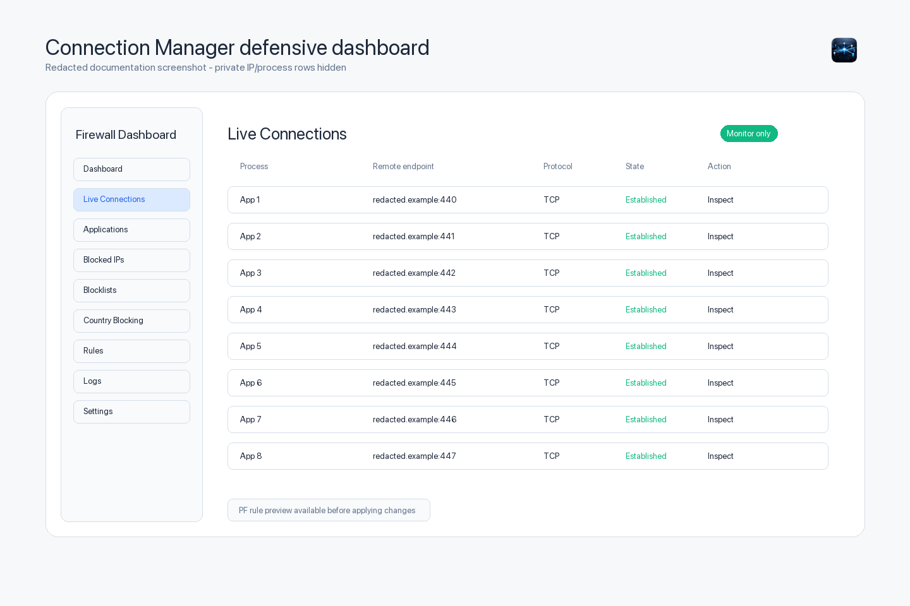
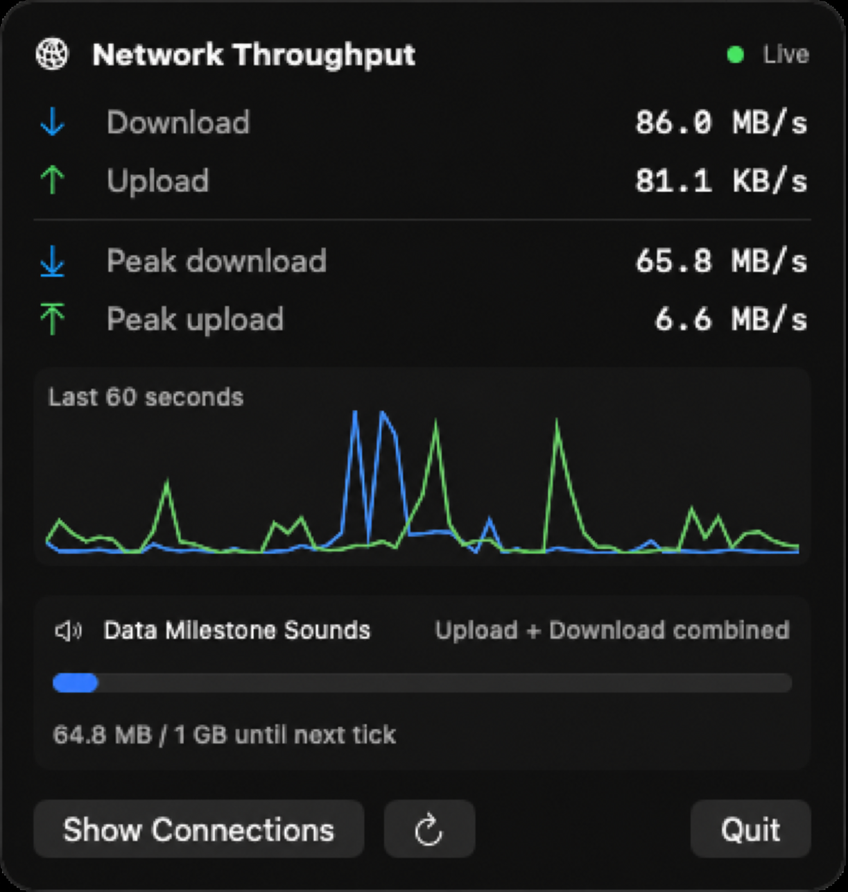
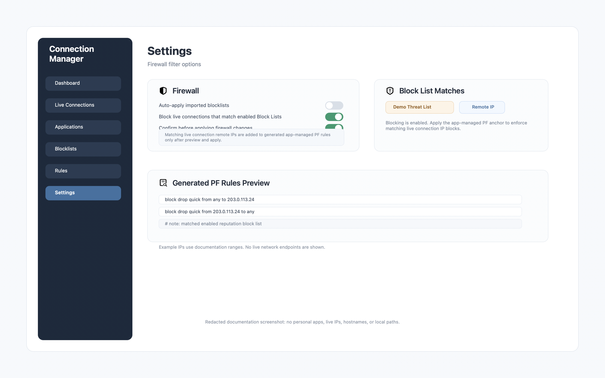

# GlossWire

GlossWire is a native macOS SwiftUI firewall dashboard and live network connection monitor.

It is built for defensive visibility: seeing which processes are talking to the network, reviewing traffic rates, managing app-owned PF firewall rules, importing blocklists, and keeping a clear audit trail of changes.

The app is intentionally conservative. It uses dedicated PF anchors, shows generated rules before applying them, requires administrator approval for firewall writes, and avoids packet capture, credential capture, traffic interception, or stealth behavior.



## Documentation

- [User Guide](docs/USER_GUIDE.md)
- [Installation And First Run](docs/INSTALLATION.md)
- [Firewall, Startup Protection, And Recovery](docs/FIREWALL_AND_RECOVERY.md)
- [Blocklists And Provider Feeds](docs/BLOCKLISTS.md)
- [Troubleshooting](docs/TROUBLESHOOTING.md)
- [Development And Architecture](docs/DEVELOPMENT.md)
- [Feature Roadmap](docs/ROADMAP.md)
- [Plugin and Network Extension API](docs/PLUGIN_API.md)
- [Release and Hardening Guide](docs/RELEASE.md)
- [Installed UI Screenshots](docs/SCREENSHOTS.md)
- [Privacy And Security Notes](docs/PRIVACY_SECURITY.md)
- [Screenshots](docs/SCREENSHOTS.md)
- [Google Filtering Audit](docs/GoogleFilteringAudit.md)

## Highlights

- Live TCP and UDP connection monitoring.
- Persistent global Connection Timeline with process/IP filtering and flight-recorder replay controls.
- Exportable network-session recordings from retained process/endpoint metadata.
- Timeline analytics: process heatmap, country activity, connection lifetime histogram, and process/service relationships.
- Passive **What Changed?** hourly comparisons and observation-only LAN topology/service hints.
- Local **Network Intelligence** views for a daily journal, application passports, accumulated IP context, port usage, domain-family grouping, and an activity calendar.
- Presentation-safe Privacy Mode masking for timeline process names, addresses, hostnames, and paths.
- Plain-English **Why is this connected?** explanations based on visible process, protocol, port, direction, and state metadata.
- Menu bar download/upload throughput display.
- Menu-bar mini dashboard with active/new connections, recent alerts, memory footprint and system load.
- Optional draggable glass throughput bar for the desktop and every Space.
- Stable fixed-width menu bar speed formatting.
- Auto-scaling or fixed rate units: B/s, KB/s, MB/s, GB/s, b/s, Kb/s, Mb/s, and Gb/s.
- Process-aware application network activity view.
- Manual IP and CIDR blocking.
- Imported blocklists with validation and duplicate handling.
- Separately labelled, disabled-by-default FireHOL catalogue subscriptions.
- A separately labelled, disabled-by-default Bitwire IT malicious outbound-destination feed.
- Optional blocking of the Tor Project's currently known public relays and exits.
- Independent Service Blocking toggles for conventional VNC/Screen Sharing, Apple Remote Desktop, RDP, SSH/SFTP, Telnet, FTP, SMB, and Windows RPC/NetBIOS ports.
- Emergency **Stop All Blocking** and **Resume Blocking** controls that clear GlossWire-managed PF anchors without deleting saved rules or settings.
- Optional blocking of live connections that match enabled local reputation blocklists.
- Trusted allowlist entries that override generated block rules.
- Searchable multi-country IPv4/IPv6 CIDR imports from IPdeny, plus manual country-list imports.
- Opt-in known Google and Google Cloud IP range blocking from Google's published feeds.
- PF rule preview before applying.
- Event logging and SQLite persistence.
- Launch-at-login support.
- Optional startup protection modes.
- Optional adjustable texture overlays: grain, dots, weave, grid, and circuit traces.
- Explicit IP reputation and GeoIP lookup links.
- Optional ping and traceroute tools for selected public remote IPs.
- Selected-IP Nmap quick, service/version and OS scans with workbench history and export.
- Data Milestone Sounds for download, upload, or combined traffic thresholds.

## Screens

The main window is called **GlossWire** and includes:

- Dashboard
- Live Connections
- Applications
- Blocked IPs
- Blocklists
- Country Blocking
- Rules
- Logs
- Settings

Closing the window hides it instead of quitting. The app remains available from the menu bar. Login-item launches also keep the main window hidden until **Show Connections** is selected from the menu bar; launching the app manually opens the window normally.

## Menu Bar Throughput

GlossWire can show live download and upload speed directly in the macOS menu bar.

Settings include:

- Show or hide throughput text.
- Rate unit selection.
- Update interval.
- Compact or detailed display mode.

Rate units can be auto-scaling or fixed:

- Auto bytes/sec
- KB/sec
- MB/sec
- GB/sec
- Auto bits/sec
- Kb/sec
- Mb/sec
- Gb/sec

The menu bar display uses fixed-width numeric formatting so the menu bar does not shift every time the speed changes.

Example high-throughput display (`86.0 MB/s`):



### Desktop Throughput Bar

Settings > Desktop Throughput Bar can show a compact translucent overlay with the real current download and upload rates and a 60-second activity graph. Its opacity is adjustable from 25% to 100%. The bar stays above other windows, follows you across Spaces, remembers where you drag it, and can be hidden from its hover close button or the Settings toggle. It is disabled by default.

## Data Milestone Sounds

Data Milestone Sounds are optional and disabled by default.

When enabled, the app can play a tick, beep, macOS system sound, or custom audio file whenever cumulative network usage crosses a threshold.

Examples:

- Play a tick every 1 GB downloaded.
- Play a beep every 500 MB uploaded.
- Play a custom sound every 100 MB of combined upload and download traffic.

Settings include:

- Enable or disable.
- Traffic direction: download, upload, or combined.
- Threshold value and unit.
- Built-in tick.
- Built-in beep.
- macOS system sound.
- Custom audio file.
- Volume.
- Cooldown/rate limit.
- Test Sound.
- Reset Counter.

The feature uses the existing network byte counters. It does not create a second polling loop. If traffic jumps across multiple milestones in one sample, the app plays only one sound and advances the next milestone correctly.

Custom audio files can use common macOS-supported audio formats such as MP3, WAV, M4A, AIFF, and AAC. They are stored with security-scoped bookmarks where macOS requires them. If a custom sound cannot be found later, the app falls back to the built-in tick and shows a non-fatal warning.


## Firewall Model

GlossWire uses macOS PF through app-managed anchors.

The primary app anchor is:

```text
com.apple/com.connectionmanager.blocked
```

The default anchor file is:

```text
/etc/pf.anchors/com.connectionmanager.blocked
```

Generated blocking rules look like:

```pf
block drop in quick from <IP_OR_CIDR>
block drop out quick to <IP_OR_CIDR>
```

The app does not redirect traffic to localhost, does not flush the global PF ruleset, and does not edit unrelated PF anchors.

## Startup Protection

Settings include a Startup section with:

- Start GlossWire at startup.
- Startup Mode.
- PF startup status.
- Last startup timestamp.
- Last synchronization timestamp.

Start at startup uses Apple's modern login item APIs through `SMAppService`. Depending on local macOS policy, the user may still need to approve GlossWire in System Settings > Login Items.

When macOS identifies the launch as a login-item launch, GlossWire starts its monitoring and menu bar item without presenting the main window. Use **Show Connections** in the menu bar popover to reveal it. This does not affect normal manual launches.

When startup launch is enabled and no startup protection mode is already selected, GlossWire selects **Strict Startup Lock** and asks for administrator approval to install the startup PF anchor. The on-disk startup anchor blocks all non-loopback traffic by default so network traffic cannot pass before GlossWire starts. After the app is running, it synchronizes the live PF startup anchor with the normal generated app rules while keeping the strict on-disk startup anchor ready for the next boot.

Startup protection is separate from launch at login. It uses dedicated PF anchors:

```text
com.connectionmanager.startup
com.connectionmanager.rules
com.connectionmanager.blocklists
```

Startup modes:

- **Monitor Only**: no startup PF rules.
- **Protection at Boot**: keeps app-managed rules active and synchronizes after launch.
- **Strict Startup Lock**: advanced mode that blocks all non-loopback traffic until GlossWire starts and synchronizes PF.

Strict Startup Lock requires an additional confirmation. It can affect network connectivity if misconfigured.

Recovery options:

- Reopen GlossWire and use **Rollback Startup Protection** in Settings.
- Or remove `/etc/pf.anchors/com.connectionmanager.startup` with administrator privileges and reload the anchor.

## Live Connection Monitoring

Live connection data is collected with standard macOS command-line tools on background tasks:

```text
/usr/sbin/lsof -i -n -P
/usr/sbin/netstat -anv
```

Connections are deduplicated by:

- Protocol.
- Local address.
- Local port.
- Remote address.
- Remote port.
- PID.

The app tracks first-seen and last-seen timestamps for live connection rows. Live connection rows are not persisted by default.


## Applications View

The Applications view groups observed network activity by application/process. It helps answer practical questions like:

- Which app is currently making connections?
- Which app has the most recent network activity?
- Which local process is associated with a remote endpoint?

Application network history is stored separately from the firewall rule database and can be trimmed or cleared by app logic.


## Blocklists

Supported import formats:

- `.txt`
- `.ip`
- `.list`
- simple `.csv`

Import rules:

- Blank lines are ignored.
- Lines beginning with `#` or `;` are ignored.
- CSV imports use the first column.
- IPv4, IPv4 CIDR, IPv6, and IPv6 CIDR are accepted where practical.
- Invalid entries are skipped and counted.
- Duplicate entries are removed.
- Private LAN ranges import with warnings.

### Reputation-Matched Live Connection Blocking

Enabled reputation blocklists are checked locally against live connection remote IPs. By default, matches are informational. In Settings, the **Block live connections that match enabled Block Lists** option can add matching live connection remote IPs to the generated app-managed PF rules.

This option is deliberately gated:

- It only uses enabled local blocklists.
- It adds remote IP rules to the generated preview.
- It still requires the normal PF rule preview and administrator-approved apply flow.
- It deduplicates repeated remote IPs before generating rules.
- It can be turned off without deleting imported blocklists or logs.



## Known Google Range Blocking

GlossWire includes an opt-in preset to block all IP/CIDR ranges published in Google's official `goog.json` and `cloud.json` feeds.

This is broad IP-range blocking. It may disrupt:

- Google Search.
- Gmail.
- YouTube.
- Android services.
- Chrome synchronization.
- reCAPTCHA.
- Firebase.
- Google APIs.
- Customer services hosted on Google Cloud.

The app stores the downloaded ranges in a managed blocklist, shows them in the normal PF rule preview, and applies them only through the normal administrator-confirmation flow. The preset can be disabled without deleting audit history.

## Known Tor Relay Blocking

The **Block known public Tor relays and exits** toggle near the top of Firewall settings downloads the Tor Project Onionoo catalogue and maintains a separately labelled managed blocklist. Enabling or disabling it uses the normal PF preview and administrator-confirmation path. This can disrupt Tor and `.onion` access, but it cannot guarantee a complete Tor block because unpublished bridges and other proxies may bypass IP-based filtering.

## Service Blocking

Settings includes independent toggles for common remote-access and file-sharing services. GlossWire can block conventional VNC/Screen Sharing, Apple Remote Desktop administration, Microsoft RDP, SSH/SFTP, Telnet, FTP, SMB, and Windows RPC/NetBIOS ports in both directions. These rules appear in the generated PF preview and use the normal administrator-approved apply path.

This is port-based protection. A service moved to a custom port or tunnelled through VPN, SSH, HTTPS, or another transport cannot be identified reliably by PF alone.

## Emergency Blocking Pause

If a rule blocks an essential service, use **Settings → Firewall → Stop All Blocking**. After administrator approval, GlossWire clears its active app and startup PF anchors while preserving configured rules, blocklists, service toggles, and startup mode. The paused state persists until **Resume Blocking** successfully restores the saved configuration. This control does not modify unrelated macOS or third-party PF anchors.

## Country Blocking

Country Blocking is opt-in only. No country rules are enabled by default.

Users may import country-level CIDR data from sources they provide, such as:

- IPdeny country zone files.
- DB-IP country range exports.
- MaxMind GeoLite2-derived exports if the user supplies licensed data.
- Custom country/IP/CIDR CSV files.

The app does not bundle proprietary GeoIP databases and does not scrape country range sources.

Before applying country blocks, review the simulation panel. Country-level IP blocking is broad and may break websites, CDNs, APIs, game servers, software updates, cloud services, VPN endpoints, and legitimate users.

## GeoIP And Reputation Lookups

GeoIP and reputation lookups are explicit user actions only.

When a public remote IP is selected, the app can open a third-party lookup page in the default browser. Provider presets include:

- ipinfo.io
- Hurricane Electric BGP
- AbuseIPDB
- IP Location
- IP2Location Demo
- DomainTools WHOIS
- Cisco Talos
- VirusTotal

The app substitutes the selected IP into the provider URL and opens it with `NSWorkspace`. It does not scrape those pages, embed them, or require API keys.

Before first use, the app warns that the selected IP address will be sent to a third-party website. Local, private, multicast, broadcast, and unspecified addresses are refused for lookup.

GeoIP and reputation results can be wrong because of VPNs, CDNs, proxies, cloud hosting, and mobile networks.

## Ping And Traceroute

Ping and traceroute are optional advanced actions on the selected connection only. They are never used by default, never run automatically, and never run in bulk.

Traceroute uses:

```text
/usr/sbin/traceroute
/usr/sbin/traceroute6
```

Ping uses:

```text
/sbin/ping
```

Before first traceroute use, the app warns that traceroute sends network probes toward the selected host and may be logged, blocked, or misleading. Output streams into the details panel and can be stopped, copied, or saved.

Local, private, multicast, broadcast, unspecified, and empty remote IPs are disabled for ping and traceroute.

## Persistence

Firewall state is stored in SQLite under Application Support:

```text
~/Library/Application Support/Live Connections Monitor/firewall.sqlite
```

Persisted firewall data includes:

- Blocklists.
- Blocklist entries.
- Manual blocked IPs.
- Trusted allowlist entries.
- Firewall event logs.
- Settings.

Application network history uses a separate local SQLite database under Application Support.

Throughput and Data Milestone Sound settings are stored in `UserDefaults`.

## Safety Limits

GlossWire validates addresses before import or blocking.

The app refuses dangerous or non-routable special addresses such as:

- `127.0.0.0/8`
- `::1`
- `0.0.0.0`
- `::`
- `224.0.0.0/4`
- `ff00::/8`
- `255.255.255.255`

Private LAN ranges warn before import:

- `10.0.0.0/8`
- `172.16.0.0/12`
- `192.168.0.0/16`
- `fc00::/7`

Default gateway detection is included in lower-level firewall confirmation paths.

## Admin Permission

Applying PF rules requires administrator permission.

The current implementation uses AppleScript administrator privileges to write the app anchor and reload only that anchor:

```sh
pfctl -a com.apple/com.connectionmanager.blocked -f /etc/pf.anchors/com.connectionmanager.blocked
pfctl -e
```

A production privileged helper could replace this later, but the privileged boundary is isolated in `FirewallBlockService`.

## What This App Does Not Do

GlossWire does not implement:

- Packet capture.
- Man-in-the-middle interception.
- Credential capture.
- Deauthentication.
- Exploitation.
- Automatic or unsolicited port scanning. User-selected local/private targets can be scanned explicitly through the Nmap workbench when Nmap is installed.
- Stealth behavior.
- Traffic redirection.
- Kernel extensions.
- Browser cookie/session access.

It is a local defensive utility for visibility, rule generation, and deliberate user-confirmed PF changes.

## Requirements

- macOS 14 or later.
- Xcode with Swift 6.3 toolchain.
- Administrator permission for applying PF firewall rules.

## Build

From the repository root:

```sh
swift build
```

Run tests:

```sh
swift test
```

Build a signed local `.app` bundle:

```sh
./scripts/build-app.sh
```

The app bundle is written to:

```text
build/GlossWire.app
```

## Install Locally

After building:

```sh
cp -R "build/GlossWire.app" /Applications/
open "/Applications/GlossWire.app"
```

If an older copy is running, quit it before replacing the app bundle.

## Development Notes

The project is organized as a Swift Package:

```text
Sources/LiveConnectionsMonitor
Sources/LiveConnectionsMonitorCore
Tests/LiveConnectionsMonitorTests
Resources
scripts
docs
```

Most app logic lives in `LiveConnectionsMonitorCore` so it can be tested without launching the full SwiftUI app.

Current test coverage includes:

- Connection parsing.
- Address validation.
- Firewall rule generation and evaluation.
- Blocklist parsing.
- Google range document parsing.
- Application network database persistence.
- Throughput formatting.
- Data Milestone Sound threshold logic.

## Privacy

GlossWire is local-first.

It does not require an account, does not include analytics, and does not send telemetry.

Network-related data leaves the machine only when the user explicitly opens a third-party lookup page, runs ping/traceroute toward a selected host, or refreshes externally hosted range feeds such as Google's published IP range documents.

## Credits

Created by **FPV-dB**.

## Source And Use Terms

This project is open-source/source-available for personal and non-commercial use.

You are free to copy, study, and modify it as you please, as long as you credit **FPV-dB**.

You agree not to sell the app, sell modified versions, sell bundled copies, or use any part of this project in a product or service offered for sale.
