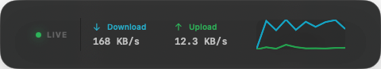

# GlossWire Screenshots

## Installed throughput overlay

This window-only capture comes from the installed `/Applications/GlossWire.app`. It shows the live state indicator, current download/upload rates, and rolling throughput lines without exposing the surrounding desktop.

The overlay does not initiate probes. Internet Weather measurements occur only from their dedicated page.
